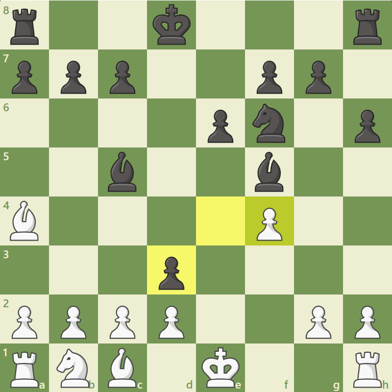

<a name="readme-top"></a>


<!-- PROJECT SHIELDS -->
[![Contributors][contributors-shield]][contributors-url]
[![Stargazers][stars-shield]][stars-url]
[![GNU License][license-shield]][license-url]


<!-- PROJECT LOGO -->
<br />
<div align="center">
  <a href="https://github.com/Blackwolf4183/ChessBot_ComputerVision">
    
  </a>

  <h3 align="center">OpenCV ChessBot</h3>

  <p align="center">
    Bot for automatic chess playing on <a href="https://chess.com">Chess.com</a>
    <br />
    <a href="https://github.com/Blackwolf4183/ChessBot_ComputerVision"><strong>Explore the docs »</strong></a>
    <br />
    <br />
    <a href="https://github.com/Blackwolf4183/ChessBot_ComputerVision">View Demo</a>
    ·
    <a href="https://github.com/Blackwolf4183/ChessBot_ComputerVision/issues">Report Bug</a>
    ·
    <a href="https://github.com/Blackwolf4183/ChessBot_ComputerVision/issues">Request Feature</a>
  </p>
</div>


<!-- TABLE OF CONTENTS -->
<details>
  <summary>Table of Contents</summary>
  <ol>
    <li>
      <a href="#about-the-project">About The Project</a>
      <ul>
        <li><a href="#built-with">Built With</a></li>
      </ul>
    </li>
    <li>
      <a href="#getting-started">Getting Started</a>
      <ul>
        <li><a href="#prerequisites">Prerequisites</a></li>
      </ul>
    </li>
    <li><a href="#usage">Usage</a></li>
    <li><a href="#contributing">Contributing</a></li>
    <li><a href="#license">License</a></li>
    <li><a href="#contact">Contact</a></li>
    <li><a href="#acknowledgments">Acknowledgments</a></li>
  </ol>
</details>


<!-- ABOUT THE PROJECT -->
## About The Project
<div align="center" style="margin-top:20px; margin-bottom:20px">
  
</div>

This bot was born as the result of a final project for the course "Computer Vision" in the University of Malaga (UMA). With all the knowledge we have been adquiring throughout the semester and a bit of python and openCV magic we were able to develop an autonomous system capable of playing *hands-free* againts anyone in the famous website <a href="https://Chess.com">Chess.com</a> . 


<p align="right">(<a href="#readme-top">back to top</a>)</p>


### Built With

This project was solely built with Python and the help of many libraries such as:  

* <a href="https://opencv.org/">OpenCV</a>
* <a href="https://pyautogui.readthedocs.io/en/latest/">PyAutoGUI</a>
* <a href="https://pypi.org/project/imutils/">Imutils</a>
* <a href="https://python-chess.readthedocs.io/en/latest/">PythonChess</a>


<p align="right">(<a href="#readme-top">back to top</a>)</p>


<!-- GETTING STARTED -->
## Getting Started

First of all to get the repo in your local machine you will need to execute
```sh
  git pull https://github.com/Blackwolf4183/ChessBot_ComputerVision.git
  ```


To run this project I recommed creating a virtual environment with python with 
```sh
  python3 -m venv /project_folder
  ```
After that, to install the libraries needed use 
```sh
  pip install -r requirements.txt
  ```

### Prerequisites

For this project you will need python 3 or higher and the dependencies listed in *requirements.txt*


<p align="right">(<a href="#readme-top">back to top</a>)</p>


<!-- USAGE EXAMPLES -->
## Usage

To use this bot you simply need to write in console or execute _(While being on the environment previously created)_
```sh
  python3 pieceprompt.py 
  ```

This will show a window in which you will have to choose the color of the pieces you will be playing. 
You also need to have a browser with Chess.com in an active game in order for it to work.

**It's important to mention that this bot only works with the default pieces and background in Chess.com, if you change them it will probably not give the expected results as it uses template matching to recognize the pieces.**


<p align="right">(<a href="#readme-top">back to top</a>)</p>


<!-- CONTRIBUTING -->
## Contributing

Contributions are what make the open source community such an amazing place to learn, inspire, and create. Any contributions you make are **greatly appreciated**.

If you have a suggestion that would make this better, please fork the repo and create a pull request. You can also simply open an issue with the tag "enhancement".
Don't forget to give the project a star! Thanks again!

1. Fork the Project
2. Create your Feature Branch (`git checkout -b feature/AmazingFeature`)
3. Commit your Changes (`git commit -m 'Add some AmazingFeature'`)
4. Push to the Branch (`git push origin feature/AmazingFeature`)
5. Open a Pull Request

<p align="right">(<a href="#readme-top">back to top</a>)</p>


<!-- LICENSE -->
## License

Distributed under the MIT License. See `LICENSE.txt` for more information.

<p align="right">(<a href="#readme-top">back to top</a>)</p>


<!-- CONTACT -->
## Contact
Mario García Borrego - [@your_twitter](https://twitter.com/your_username) - mariogarcia@gmail.com
</br>
Pablo Pérez Martín - [@your_twitter](https://twitter.com/your_username) - pablopm31715@gmail.com


Project Link: [https://github.com/Blackwolf4183/ChessBot_ComputerVision](https://github.com/Blackwolf4183/ChessBot_ComputerVision)

<p align="right">(<a href="#readme-top">back to top</a>)</p>


<!-- MARKDOWN LINKS & IMAGES -->
<!-- https://www.markdownguide.org/basic-syntax/#reference-style-links -->
[contributors-shield]: https://img.shields.io/github/contributors/Blackwolf4183/ChessBot_ComputerVision?style=for-the-badge
[contributors-url]: https://github.com/Blackwolf4183/ChessBot_ComputerVision/graphs/contributors
[forks-shield]: https://img.shields.io/github/forks/othneildrew/Best-README-Template.svg?style=for-the-badge
[forks-url]: https://github.com/Blackwolf4183/ChessBot_ComputerVision/network/members
[stars-shield]: https://img.shields.io/github/stars/Blackwolf4183/ChessBot_ComputerVision?style=for-the-badge
[stars-url]: https://github.com/Blackwolf4183/ChessBot_ComputerVision/stargazers
[issues-shield]: https://img.shields.io/github/issues/othneildrew/Best-README-Template.svg?style=for-the-badge
[issues-url]: https://github.com/Blackwolf4183/ChessBot_ComputerVision/issues
[license-shield]: https://img.shields.io/github/license/othneildrew/Best-README-Template.svg?style=for-the-badge
[license-url]: https://github.com/Blackwolf4183/ChessBot_ComputerVision/blob/master/LICENSE.txt
[linkedin-shield]: https://img.shields.io/badge/-LinkedIn-black.svg?style=for-the-badge&logo=linkedin&colorB=555
[linkedin-url]: https://linkedin.com/in/othneildrew
[product-screenshot]: images/board.png
